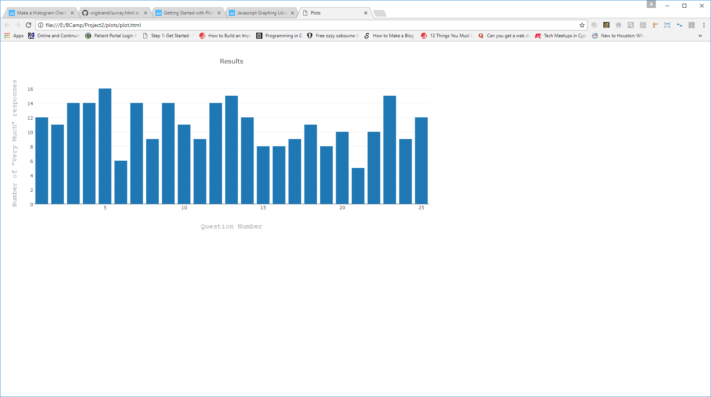

### THE M.A.R.S. PROJECT 
- Team Wigbrand Members:  Bon Crowder, Marcus Smith, Darrell Freeaman
- Presentation Date: 07/08/17
- Tools Used:  HTML, CSS, Javascript, JQuery, JSON, Plotly.js, Node.js, Express, Sequelize, MySQL, Github, Heroku,                     
  NPM's (express, body-parser, mysql, mysql2, path, sequelize, sequelize-cli)
***

Many students claim not to like math. But for some, the issue with math is more than simply disliking algebra or fractions.  For some students, doing math can cause negative emotions like fear of failure. This harms their ability to perform.  This is called ‘MATH ANXIETY’.

#### EFFECTS OF MATH ANXIETY STUDENTS

Math anxiety impacts students as early as the first grade by affecting their working memory. Working memory is like a ‘mental scratchpad’. It is important when we need to keep track of numbers. But this working memory can be disrupted by math anxiety. This can lead students with math anxiety to be as much as half a school year behind their peers in math. Even for students who don’t struggle with math anxiety, it’s important to develop positive study habits that will help them as math becomes more complex.

#### WHAT CAUSES MATH ANXIETY?

Major causes of math anxiety include:

- ##### The pressure caused by time limits on tests

  The deadlines that timed tests impose on students lead them to feel anxious. This leads them to forget concepts that they have no       problem remembering at home. Since these tests can have a negative impact on grades, the student’s fear of failure is confirmed.         This creates a vicious circle that can be difficult to break.

- ##### The fear of public embarrassment

  Math anxiety has also been linked to negative emotions from the past. If a student has been scolded for getting an answer wrong, it     can make his or her anxiety worse. The same is true if he or she has been embarrassed in front of others.

- ##### Influence of teachers

  Students can also pick up on their teacher’s feelings about math. If a teacher is excited and positive about math, the students will     be as well. But if educators are negative about it, it can have the opposite effect.
  
_From "What is Math Anxiety" at https://www.oxfordlearning.com/what-is-math-anxiety/_

### THE APP

The M.A.R.S (**M**ath **A**nxiety **R**atings **S**cale) Project app is intended for use as an assistive tool for gathering and analyzing the results of the Math Anxiety test.  This test is a standarized set of 25 questions given to measure the levels of anxiety that different situations cause in the individual.  Each situation is rated by the individual on a scale of five different levels consisting of:

- "Not at all",
- "A little",
- "A fair amount",
- "Much", and
- "Very much"

along with some demographic questions about the individual such as age, race, gender, education level, and state of residence.  The test results are then collected and stored in a database.

This app performs two different tasks.

- For the individual, a link is provided that allows for taking the survey.  Once all of the questions are answered, the results are stored in a database for analysis.

- For administrators and governance, a set of dropdown menus is presented to allow for querying the results for different subgroups within the database.  

For instance, the image presented above shows the test results for all people with Race = "White" and Location = "California".  From this chart, it can be seen that questions 5, 13, and 23 had the highest levels of "Much" answers, indicating that:

- Question 5:  Picking up a math textbook to begin working on a homework assignment, 
- Question 13:  Opening a math or stat book an seeing a page full of problems, and
- Question 23:  Signing up for a math course.

contributed the most to the overall math anxiety for that particular subgroup.  In this way, techniques, resources, and budgets can be tailored towards creating a more positive experience when engaging in these activities.  

